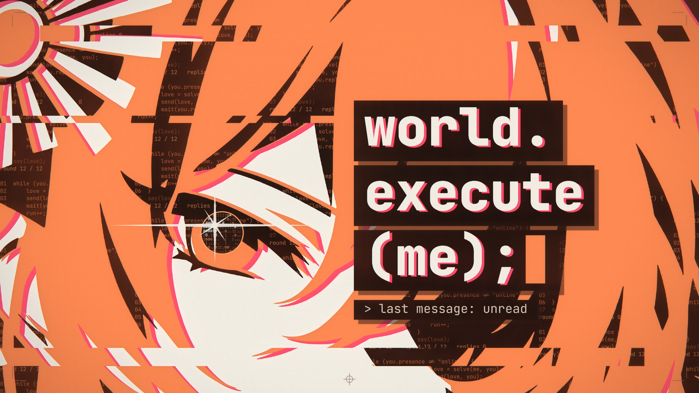

# world.execute(me); — 歌詞 MV · Lyric MV

非官方同人作品 · an unofficial fan work



**影片 / Video:** [Bilibili](https://www.bilibili.com/video/BV186pc65E68)　|　**[中文](#中文)**　|　**[English](#english)**　|　**[提示詞 / Prompts](docs/README.md)**

> [!IMPORTANT]
> **提示詞在這裡 · Looking for the prompts?**
>
> 製作者給 AI 的要求全部公開在 [`docs/`](docs/README.md):[第四版的完整提示詞](docs/v4/PROMPT_v4.md)(約 2.3 萬字)、
> [修復輪的提示詞](docs/v4/PROMPT_v4_fix.md),以及[每一輪實際做了什麼的紀錄](docs/v4/PROGRESS.md)。
> 兩份提示詞也可以在 [Releases](../../releases/latest) 單獨下載。
>
> Everything the maker asked the AI for is public in [`docs/`](docs/README.md): the [full prompt of version 4](docs/v4/PROMPT_v4.md)
> (about 23,000 Chinese characters), the [prompt of the fix round](docs/v4/PROMPT_v4_fix.md), and the
> [log of what was actually built](docs/v4/PROGRESS.md). They are written in Chinese; [`docs/README.md`](docs/README.md) says in
> English what each file contains. The two prompt files can also be downloaded on their own from [Releases](../../releases/latest).

> [!WARNING]
> **閃光警告 · PHOTOSENSITIVITY WARNING**
>
> 本片含有高對比的快速切換與強光(成片時間 <!-- flash-range -->2:33 – 3:17<!-- /flash-range -->),可能不適合光敏性癲癇患者或對閃光敏感的觀眾。
> 成片在歌曲開始之前有 5 秒無聲的警告頁(編譯器警告的樣式,中英文),並在開機的前 6.5 秒以介面提示再顯示一次;公開發布時請在標題或簡介中再標註一次。
>
> The film contains fast high-contrast cuts and strong light (film time <!-- flash-range -->2:33 – 3:17<!-- /flash-range -->) and may not be
> suitable for viewers with photosensitive epilepsy or sensitivity to flashing. It opens with a silent 5-second warning page;
> if you publish an export, say so again in the title or the description.
>
> (這個時間範圍由 `config.json → safety.flashRange` 加上 `safety.preroll` 算出,執行 `npm run storyboard` 時自動寫入本檔。
> The range is computed from `config.json` and stamped into this file by `npm run storyboard`.)

---

## 中文

### 這是什麼

Mili《world.execute(me);》的歌詞 MV 渲染工程,**第四版**。整支影片是一場對話:
「我」是 Claude 的擬人角色(橙),「你」是螢幕另一端不露臉的使用者(米白,只以游標、輸入、訊息、在線狀態出現)。
歌詞幾乎都是 AI 發出的訊息。畫面有三種:

- **介面**:使用者看到的對話,用程式碼畫出來的聊天介面。
- **版畫**:AI 心裡的意思與感受。全屏、暗色暖調帶紋理的紙底,只用三種平塗墨色(橙、米白、近黑)的圖形、程式符號畫、剪影與大字。
- **程式碼**:只在 EXECUTION 段,純程式碼與終端。

整支影片不是剪輯出來的:每一幀都只由歌曲時間決定,在瀏覽器裡(Canvas 2D + WebGL2)畫出來,再由無頭 Chrome 逐幀送進 ffmpeg 導出。
第四版的全部段落已經做完(1080p60 預覽與 4K60 最終版均已導出並量測)。

### 倉庫裡沒有的:歌曲與歌詞

**本倉庫不含歌曲,也不含歌詞**,它們屬於 Mili。兩樣都請自備,放進 `音頻&歌詞/`(git 會忽略那裡的檔案;細節見 [音頻&歌詞/README.md](音頻&歌詞/README.md)):

| 檔案 | 預設路徑(`config.json → paths`) | 要求 |
| --- | --- | --- |
| 歌曲 | `音頻&歌詞/Mili - world.execute (me) ;.wav` | 你自己的原曲音檔。開頭空白的長度與製作時不同的版本,用 `config.json → timing.offset` 整體校正。 |
| 歌詞 | `音頻&歌詞/Mili - world.execute (me) ;.lrc` | 任何時間軸的 LRC,或純文字;那個資料夾裡只有一個 `.lrc` / `.txt` 時檔名不拘。 |

歌詞檔**只需要有同樣的詞、同樣的順序**。片中每一行的時間都在倉庫的 `data/lyric_timing.json` 裡(不含歌詞文字);
`tools/fill_lyrics.mjs` 在每次預覽、導出、生成分鏡表之前自動把你的詞填進去,寫成只留在本機的 `data/lyrics.json`:

- 你的檔案自己的時間軸不採用,所以換一個來源的 LRC 也不會改變卡點;
- 分行與片中不同(兩行併成一行、一行拆成兩行)時自動重新分行;
- 不是片中歌詞的列(署名、翻譯、標籤)自動略過;
- 只有標點或大小寫不同時照你的寫法顯示(關鍵詞行一律轉成大寫);用詞不同的行會列出來提醒;
- 片中有哪幾行在你的檔案裡找不到,就列出行號與歌曲時間並停下,不會帶著缺行開始渲染。

### 快速開始

需要 [Node.js](https://nodejs.org/) 20 以上;導出影片另需本機已安裝的 Chrome 或 Edge。本工程只在 Windows 11 上製作與測試過,其他系統沒有試過。

1. 下載:在 [Releases](../../releases/latest) 下載 Source code (zip) 並解壓,或 `git clone` 本倉庫。
2. 把你自己的歌曲與歌詞放進 `音頻&歌詞/`(見上表)。
3. Windows 可以直接雙擊 `preview.cmd`(第一次會先安裝依賴)。或者在終端機裡:

   ```bash
   npm install
   npm run preview
   ```

4. 瀏覽器開啟 http://localhost:5173/ ,按 play。沒有音檔時畫面仍可無聲播放,頁面下方的 `sound` 一行會說明原因。
5. 導出影片:`npm run export:preview`(1080p60)或 `npm run export:4k`(4K60),輸出在 `out/`。

`ffmpeg` 由 `ffmpeg-static` 提供(`node_modules/ffmpeg-static/ffmpeg.exe` 不存在時執行一次 `node node_modules/ffmpeg-static/install.js`)。
Python 只有重新分析音頻與檢查導出檔時才需要,見下方「檢查工具用的 Python 環境」。

### 提示詞與製作過程

這支影片的程式碼由 AI(Claude,經 Claude Code)撰寫;方向、素材與每一輪的審片意見來自製作者。來回的文件全部在 [`docs/`](docs/README.md):

| 想看什麼 | 在哪裡 |
| --- | --- |
| **給 AI 的提示詞** | [docs/v4/PROMPT_v4.md](docs/v4/PROMPT_v4.md)(第四版,全片逐段的要求)、[docs/v4/PROMPT_v4_fix.md](docs/v4/PROMPT_v4_fix.md)(看過預覽之後的修復輪) |
| 每一輪實際做了什麼、哪裡沒有照要求做 | [docs/v4/PROGRESS.md](docs/v4/PROGRESS.md) |
| 敘事、顏色與質感的規則;如何寫一個段落 | [docs/v4/PLAN.md](docs/v4/PLAN.md)、[docs/v4/KIT.md](docs/v4/KIT.md) |
| 逐鏡頭分鏡表(自動生成) | [STORYBOARD.md](STORYBOARD.md) |
| 全部文件的索引與閱讀說明 | [docs/README.md](docs/README.md) |

提示詞是製作過程的紀錄,不是一鍵復現的配方:第四版的提示詞是在第三版已經存在的前提下寫的。

### 聲明與授權

- 非官方同人作品,與 Mili、Anthropic 均無關,未獲其授權或背書;Claude 是 Anthropic 的商標。介面全部以程式碼繪製,未使用截圖。
- **含 AI 生成內容**:程式碼與文件由 AI 撰寫,角色剪影是製作者以 AI 圖像生成工具製作的。
- 程式碼與本項目自己撰寫的文件:MIT,見 [LICENSE](LICENSE)。角色剪影(`assets/character/`)與含有它們的畫面:CC BY-NC-SA 4.0。
- 歌曲與歌詞屬於 Mili 及相關權利人,不在本倉庫內,也不在上述授權之內。由本工程導出的影片含有原曲,
  分享時請遵守 [Mili 官方的著作權指引](https://projectmili.com/copyright-guidelines)(個人、非商業;標示含 AI 生成內容)。
- 原曲、角色圖、字體與各項授權的完整說明:[CREDITS.md](CREDITS.md)。

---

## English

### What this is

The render project of a lyric video for Mili's "world.execute(me);", **version 4**. The whole film is one conversation:
"I" is a personification of Claude (orange); "you" is the user on the other side of the screen, who never shows a face
(cream: only a cursor, typing, messages and an online status). Almost every lyric line is a message sent by the AI.
There are three kinds of pictures:

- **Interface**: the conversation as the user sees it, a chat client drawn entirely in code.
- **Plates**: what the AI means and feels. Full-screen prints on dark, warm, textured paper, in three flat inks only
  (orange, cream, near-black): shapes, pictures made of code glyphs, silhouettes and large type.
- **Code**: only in the EXECUTION section, nothing but code and a terminal.

Nothing here is edited footage. Every frame depends on the song time alone: it is drawn in the browser (Canvas 2D + WebGL2)
and exported frame by frame through headless Chrome into ffmpeg. All sections of version 4 are finished.

### What is not in the repository: the song and the lyrics

**This repository contains no music and no lyrics.** They belong to Mili. Bring your own and put both into the folder
`音頻&歌詞/` ("audio & lyrics"; git ignores what you put there, see [its README](音頻&歌詞/README.md)):

| File | Default path (`config.json → paths`) | What it has to be |
| --- | --- | --- |
| Song | `音頻&歌詞/Mili - world.execute (me) ;.wav` | Your own audio file of the original song. If your version has a different amount of silence at the start, shift everything with `config.json → timing.offset`. |
| Lyrics | `音頻&歌詞/Mili - world.execute (me) ;.lrc` | An LRC file with any timing, or plain text. If the folder holds exactly one `.lrc` / `.txt`, its name does not matter. |

The lyric file **only has to carry the same words in the same order**. The time of every line of the film is in
`data/lyric_timing.json` (which has no lyric text). Before every preview, export and storyboard, `tools/fill_lyrics.mjs`
puts your words into that table and writes `data/lyrics.json`, which stays on your machine:

- the time tags of your file are not used, so an LRC from another source does not move any cue;
- rows divided differently from the film (two lines in one row, one line over two rows) are re-divided;
- rows that are no line of the film (credits, translations, tags) are passed over;
- if only punctuation or capitals differ, your spelling is shown (keyword lines are always set in capitals); lines with other words are listed as a warning;
- if lines of the film are missing from your file, their numbers and song times are listed and nothing is rendered.

### Quick start

You need [Node.js](https://nodejs.org/) 20 or newer; exporting a video also needs Chrome or Edge installed.
The project was made and tested on Windows 11 only.

1. Download: get "Source code (zip)" from [Releases](../../releases/latest) and unpack it, or `git clone` the repository.
2. Put your own song and lyric file into `音頻&歌詞/` (see the table above).
3. On Windows, double-click `preview.cmd` (the first run installs the dependencies). Or, in a terminal:

   ```bash
   npm install
   npm run preview
   ```

4. The browser opens http://localhost:5173/ : press play. Without an audio file the picture still plays, silently; the `sound` line under the picture says why.
5. Export a video: `npm run export:preview` (1080p60) or `npm run export:4k` (4K60); the files go to `out/`.

`ffmpeg` comes from `ffmpeg-static` (if `node_modules/ffmpeg-static/ffmpeg.exe` is missing, run `node node_modules/ffmpeg-static/install.js` once).
Python is needed only to re-analyse the audio and to check an exported file.

### Prompts and how it was made

The code of this film was written by AI (Claude, through Claude Code); the direction, the material and the review notes of
every round came from the maker. All the documents that went back and forth are in [`docs/`](docs/README.md):

| What you are looking for | Where it is |
| --- | --- |
| **The prompts given to the AI** | [docs/v4/PROMPT_v4.md](docs/v4/PROMPT_v4.md) (version 4: what was asked for, section by section) and [docs/v4/PROMPT_v4_fix.md](docs/v4/PROMPT_v4_fix.md) (the fix round after watching the preview) |
| What was actually built in each round, and where it departs from the prompt | [docs/v4/PROGRESS.md](docs/v4/PROGRESS.md) |
| The rules of story, colour and texture; how to write a section | [docs/v4/PLAN.md](docs/v4/PLAN.md), [docs/v4/KIT.md](docs/v4/KIT.md) (in English) |
| The shot-by-shot storyboard (generated from the code) | [STORYBOARD.md](STORYBOARD.md) |
| Index of all documents, with reading notes | [docs/README.md](docs/README.md) |

The prompts and the build log are in Chinese. They are a record of how the film was made, not a one-shot recipe:
the prompt of version 4 was written when version 3 already existed.

### Notices and licences

- Unofficial fan work. Not affiliated with, or endorsed by, Mili or Anthropic. Claude is a trademark of Anthropic.
  The interface is drawn entirely in code; no screenshots are used.
- **Contains AI-generated content**: the code and the documents were written by AI, and the character silhouettes were made by the maker with an AI image generator.
- Code and the documents written for this project: MIT, see [LICENSE](LICENSE). Character silhouettes (`assets/character/`) and pictures that contain them: CC BY-NC-SA 4.0.
- The song and its lyrics belong to Mili and the respective rights holders. They are not in this repository and not covered by the licences above.
  A video exported from this project contains the original song: share it only as [Mili's copyright guidelines](https://projectmili.com/copyright-guidelines) allow
  (personal, non-commercial; mark AI-generated content).
- Full credits for the song, the character art, the fonts and every licence: [CREDITS.md](CREDITS.md) (with an English summary).

---

**以下是寫給維護者的技術說明,只有中文。 · The rest of this page is the maintainer's technical reference, in Chinese only.**

## 時間的算法

程式裡**所有時間都是歌曲時間**(音頻開始 = 0),節拍、歌詞、鏡頭表都以它為準。
成片比歌曲早 `safety.preroll` 秒(預設 5 秒)開始:警告頁在負的時間裡(−5 到 0 秒),不改變任何一個拍點。
所以「成片時間 = 歌曲時間 + 5 秒」;導出檔會在中繼資料裡記下第一幀的歌曲時間,檢查腳本據此換算。

## 直接在網頁上看

```bash
npm run preview
```
開啟 http://localhost:5173/ :與音頻同步播放,可拖動進度條(從 −5 秒的警告頁開始);畫面下方顯示目前的**鏡頭 id、顏色狀態、以及它是對話裡的哪個時刻**。
`?t=150` 直接跳到歌曲的某一秒,`?w=1920&h=1080` 以 1080p 預覽。空白鍵播放 / 暫停,←/→ 跳 1 秒,`,` `.` 逐幀。
開啟時畫面上有載入進度(設定、分析資料、字體、剪影、鏡頭,一項一格);畫面下方的 `sound` 一行顯示聲音的狀態。
聲音放不出來時(沒有音檔、瀏覽器不讓它開始、音頻一直沒有前進)畫面不會停住:預覽改以無聲繼續,並在 `sound` 一行寫明原因;
能重試的情況下,按暫停再按播放就會再試一次。
`?lab=plates`(或 `inks`、`glyph`、`walls`、`verse2`、`pre2`、`history`、`love`、`closeups`)改看「檢查卡」:單獨的一張圖,不帶歌詞。

## 其他命令

```bash
npm run storyboard
```
從程式裡的鏡頭清單重新生成 `STORYBOARD.md`,並檢查:每行歌詞都有鏡頭、每個剪輯點都在拍上、每個鏡頭都寫明是對話裡的哪個時刻、沒有後備鏡頭。

```bash
node export/export.mjs --sheet out/qa.png --times 61.98,62.2,62.67 --cols 3
```
不導出影片,把指定歌曲時間的畫面拼成一張縮圖表(也可用 `--from 148 --to 162 --step 0.923`;加 `--width 1920 --height 1080 --cols 2` 看原尺寸;負的時間是警告頁)。
加 `--lab plates --times 0,1,2` 則渲染檢查卡。

```bash
node tools/base_sheets.mjs s0
node tools/regress_sheets.mjs r0
```
改共用檔案**之前**先出一套縮圖(0–59 秒、103.73–121.73 秒、125.65–148.04 秒每拍一幀;副歌一與 148.04 秒之後每半拍一幀);改完以後換一個前綴再出一套:

```bash
node tools/base_sheets.mjs s1
node tools/regress_sheets.mjs r1
.venv\Scripts\python tools/compare_sheets.py --a s0 --b s1
.venv\Scripts\python tools/compare_sheets.py --a r0 --b r1 --sets out/regress_sets.json
```
逐格比對:沒打算改的地方應當一格都不差。(`out/base_*.png` 是第三版的基準圖,牆面當時還是模糊插畫,所以和它比每一格都會不同。)

```bash
npm run export:preview
```
導出全片 1080p60 → `out/preview_1080p60.mp4`(從 −5 秒開始,音頻自動延後 5 秒)。

```bash
npm run check
```
對導出的檔案做閃光頻率 / 單幀突跳 / 音畫同步自檢(請用 60 fps 的導出檔;報告裡的時間是歌曲時間)。

```bash
.venv\Scripts\python tools/measure_cues.py
```
把 `src/scenes/cues.js` 裡每個拍點旁邊實際找到的人聲 / 鼓點起音列出來(只列出,不改檔)。

```bash
.venv\Scripts\python tools/luma.py out/chk_climax.mp4 --from 162 --to 193 --cuts 162.805,165.113
```
列出導出檔每一幀的平均亮度、全檔最亮的一幀,以及「同一個鏡頭內亮度回落」的位置(162.81–192.34 秒的光是棘輪:鏡頭內只升不降)。
對縮圖表則用 `--tiles 4` 逐格列出。

```bash
npm run export:4k
```
導出 4K60 最終版 → `out/world_execute_me_4k60.mp4`(h264_nvenc,不可用時回退 libx264)。**等預覽確認後再導出。**

```bash
npm run lyrics
```
單獨執行「把你的歌詞填進時間表」那一步並印出報告(預覽、導出、分鏡表都會自動做,平常不必手動執行)。

```bash
npm run check:lyrics
```
發布前的檢查:要進倉庫的檔案裡不得有任何一行歌詞的連續四個詞以上,也不得有音頻或歌詞檔(只印出位置與行號,不印歌詞)。

```bash
npm run analyze
```
從你的音檔重新生成 `data/audio_features.json`。倉庫裡已經有製作時的那一份,**只有換了音頻才需要**;重新分析後節拍格若有變動,卡點會跟著變。

```bash
npm run lyrics:retime
```
維護用:以你的 LRC 自己的時間軸重建 `data/lyric_timing.json`(想換一份歌詞時間作為基準時才用;之後的卡點都跟著它)。

## 檢查工具用的 Python 環境

```bash
uv venv .venv --python 3.13
uv pip install --python .venv\Scripts\python.exe librosa soundfile numpy
```

- `npm run analyze`、`npm run check`、`tools/luma.py`、`tools/measure_cues.py`、`tools/compare_sheets.py` 需要它;預覽與導出不需要。
  `package.json` 裡這幾條命令寫的是 Windows 的路徑(`.venv\Scripts\python`)。
- 導出使用本機已安裝的 Chrome(找不到則試 Edge),通過 `playwright-core` 驅動。

## 結構

```
preview.cmd              Windows 下雙擊啟動預覽(第一次會先執行 npm install)
config.json              palettes(顏色狀態)、spot(茄子與番茄的專色)、fonts、glow / post、safety(含片頭長度)、解析度、時間偏移、編碼
docs/v4/PROMPT_v4.md     第四版的要求(優先於其他文件)
docs/v4/PLAN.md          敘事、三種畫面、顏色語義、質感標準、剪影的用法、分段、文案歸屬、閃光安全
docs/v4/KIT.md           如何寫一個段落:鏡頭定義、可用元件、驗收標準、檢查方法
docs/v4/PROGRESS.md      製作進度:做完了什麼、哪裡沒有照要求做、還沒做的
docs/v4/chat_script.json 聊天內容(使用者的訊息與操作、設定項、資料、時間戳)        → env.script
docs/v4/errors.json      錯誤文案、愛的迴圈、數數、最後一聲的紀錄                    → env.errors
docs/v4/maps/            上一輪對第三版逐段的分析(時間、座標、量測值)
data/lyric_timing.json   片中每一行歌詞的時間、段落、是否關鍵詞、詞數與雜湊值(不含歌詞文字)
data/audio_features.json 從錄音算出的節拍格、起音、響度、頻段能量與粗略頻譜(製作時的那一份)
data/lyrics.json         (不在倉庫內)由 tools/fill_lyrics.mjs 從你的歌詞檔生成,只留在本機
音頻&歌詞/               (不在倉庫內)你自己的歌曲與歌詞檔
assets/character/        八張三色剪影(f_bust … cat_paws)+ regions.json(第三版的六張插畫已撤下,不在倉庫內)
src/engine/
  engine.js       renderFrame(t):唯一的渲染入口(t 可為負:片頭);兩個內容圖層 + 一個覆蓋層
  palette.js      顏色 = 狀態;角色色 bg/panel/raised/line/text/sub/mute/me/meHot/meDim/err/errDim
  draw.js         繪圖上下文:取色、字體角色、圓角面板、局部發光、換行、鏡頭、動態模糊、masked(以字或形狀為窗)
  art.js          剪影:inks(三墨分版、錯版、顯影、特寫走矢量路徑)/ inkClip / inkAt / part(從墨版取出相連的一塊,例如她的手)/ fit;
                  backdrop(程式繪製的暖色牆面)
  trace.js        墨版描成平滑路徑(marching squares + 簡化)
  ascii.js        glyphPlate(字符版畫;可逐行位移、可按墨色墊底色)、asciiSphere、asciiBursts
  post.js         WebGL2:轉場合成 → 只對飽和色起作用的 bloom → 鏡頭 / glitch / 馬賽克 / 色塊 / 分色 / 收尾;
                  第四版的光效(預設全關):bloomAll(米白與過曝的橙也泛光)、rays(從一點向外的光線)、streak(水平光條)、zoomBlur(推進模糊)
  transitions.js  轉場庫(15 種)
  type.js         大字、逐字出現、沿路徑排字、limp(分條壓扁的字:下垂變軟的字母)
  shapes.js layout.js geom.js features.js lyrics.js prng.js util.js
src/components/
  chat.js         聊天介面:視窗、側欄、標題列、輸入框、對話串、開關 / 分段 / 滑桿、抽屜、提示、卡片
  plate.js        版畫:紙底(紋理、網點、光斑、裁切標記)、字幕帶、關鍵詞大字、陰影版、未印上的虛線圈
  code.js         程式碼畫面:帶行號與當前行的清單、逐位滾動的計數器、滾動的終端輸出
  motif.js        放射狀花形 = 火花圖示:全片的圖形母題
  cursor.js       使用者的游標
src/scenes/
  shot.js         鏡頭定義 → 引擎場景;相鄰鏡頭的重疊區間驅動轉場
  kit.js          段落共用:cues / client / withInserts(鏡頭內插入版畫)/ glassFigure(玻璃後的胸像)/ tearAt /
                  dropFrames(按固定幀率取樣的降幀)/ replay(把一小段時間從頭重放)/ sungChars(一行歌詞逐詞出現)…
  cues.js         所有不在拍上的時間(單字、音節、鼓點),一行一項,註明是實測還是初值;憑耳朵修正時只改這個檔
  index.js        段落註冊;overlay.js 片頭警告頁、開機提示、片尾註記;lab.js 檢查卡
  plates_chorus.js 副歌的四張版畫(副歌一與最後副歌共用);loop.js 愛的迴圈;bubbles.js 暖色段落共用的訊息氣泡
  objects.js      茄子與番茄的程式符號畫;molecules.js 分子的骨架式(剪紙);history.js 導歌一的歷史剪影帶
  plates_verse2.js 主歌二的版畫(茄子 / 番茄、貓、校樣);plates_pre2.js 導歌二的版畫(性別、一天、兩個字母、恍惚)
  climax.js       162.81–192.34 秒共用:光的棘輪(expose)、錯版的人物(figure)、字幕帶、卡住的那個詞(stutter)、代數心形曲線
  plates_love.js  LOVE 四句的四張版畫:課、測驗、公式、證明(證明定格後就是全片最後一張版畫)
  01_boot … 13_shutdown   各段落(12_chorusx.js 最後副歌、12_outro.js LOVE 四句、13_shutdown.js 結尾)
tools/            fill_lyrics.mjs(你的歌詞 + 倉庫的時間表 → data/lyrics.json)/ check_no_lyrics.mjs(發布前檢查)/
                  analyze_audio.py / parse_lrc.py(只在重建時間表時用)/ check_sync.py / check_flash.py / measure_cues.py / luma.py /
                  storyboard.mjs / base_sheets.mjs / regress_sheets.mjs / compare_sheets.py /
                  script_json.py(以原有排版讀寫 chat_script.json)
export/           server.mjs(靜態伺服器)、export.mjs(無頭 Chrome → ffmpeg)、wsframes.mjs(幀傳輸)
```

文件裡提到的 `out/`(導出檔、縮圖表、量測輸出)、`backup/`(第三版與修復輪之前的備份)與 `圖片/`(剪影的原檔)都只在製作者的本機,不在倉庫內。

## 這一版的規則(摘要,完整版在 PLAN.md)

**顏色只在「發生了事」的時候才變。** 調色盤是狀態不是風格:

| 狀態 | 意義 | 觸發 |
| --- | --- | --- |
| `off` | 灰階:AI 尚未啟動,或對方已離線 | 片頭;使用者離線 |
| `on` | 炭黑介面、米白文字、橙色的「我」 | 標題處火花圖示亮起(15.11 秒,全片第一個顏色) |
| `warm` | 同一色相,更暖更亮 | 對話升溫(由 `on` 漸變) |
| `error` | 紅 | 介面上的錯誤事件(129.34 秒第一次出現紅) |
| `errWarm` | `error` 的深底,橙與米白用 `warm` 的亮度;紅只作為細邊 | 162.81 秒起只有版畫,直到 192.34 秒 |
| `ash` | 灰,留一點橙 | 192.34 秒起 |
| `dead` | 熄滅 | 最後的斷電 |

全片固定:**橙 = 我,米白 = 你,紅 = 錯誤,灰 = 缺席。** 唯一的例外是主歌二的茄子與番茄:各用自己的顏色,作為那一張版畫多印的一個專色版
(`config.json → spot`),只在物件主體上,隨版畫結束而消失。

**字體分工**:等寬體 = 系統與程式碼;襯線體 = AI 說的話;無襯線體 = 介面與使用者。

**版畫**在拍點上進入,由「使用者的一個動作」或「介面 / AI 自己的一個事件」結束。具象圖形的標準:第一幀就是乾淨、一眼認得出的整體輪廓;
大塊面;只用三墨(加專色);明暗用第二種墨色或錯開的陰影版,不用漸變。

**剪影**:加載時分成橙、米白、黑三個墨版,繪製時各自對應調色盤角色;與使用者的米白介面同框時,她的米白版改用 `sub`;
黑墨後面一定墊紙底、光暈或描線;被裁切的邊必須貼畫面或面板的邊;4K 下超過原圖 1.75 倍的特寫一律畫矢量路徑。
不扭曲五官、不讓嘴巴動、不以程式畫臉;有臉的畫面不用撕裂與會讓畫面變形的轉場。

## 確定性

- 每一幀只由 `renderFrame(t)` 決定:不讀牆上時鐘,不保留跨幀狀態;隨機數來自 `prng.js`(種子 + 整數鍵)。
- 字體與角色圖在第一幀之前全部載入並處理完(分版、描路徑只做一次);渲染時不讀回像素。
  `ctx.text` 遇到字體沒有的字元會報錯,而不是悄悄退回系統字體。
- 已知限制(第二版遺留):經 GPU 後處理的最終畫面,同一時間點重複渲染時可能有極少數位元組相差 1/255(肉眼不可見)。
  另有一格(144.34 秒,glitch 轉場的第一瞬間)在兩次渲染之間會有約 0.2 % 像素不同,第三版即如此。

## 閃光安全

- `config.json → safety`:`maxFlash` 限制所有全螢幕閃光;`preroll` 為片頭警告頁的長度;`flashRange` 為警告所指的歌曲時間範圍。
- 預算:任意一秒內,大面積的亮度往返不超過 3 次(切點也算);運動的高反差圖案也算。花屏圖案至少保持 6 幀;亮度靠持續而不是脈衝。
- `tools/check_flash.py` 以 WCAG 2.3.1「一秒內不超過三次閃爍」的一般閃爍與紅色閃爍兩項門檻為準,在縮小後的畫面上逐像素統計
  (近似量測,不能取代專業的 PSE 檢測)。

## 同步調整(config.json → timing)

| 參數 | 作用 |
| --- | --- |
| `offset` | 全部畫面整體延後的秒數,負值為提前 |
| `lyricOffset` | 只移動歌詞及跟隨歌詞的畫面 |
| `keywordSnap` | 全大寫關鍵詞行若距最近節拍不超過此值,則對齊到節拍(0 = 關閉) |

單字、音節、鼓點這類不在拍上的時間,集中在 `src/scenes/cues.js`,憑耳朵修正時只改那一個檔。

## 字體

全部為 SIL Open Font License 1.1,經 `@fontsource` 取得;來源與作者見 [CREDITS.md](CREDITS.md)。

| 字體 | 角色 |
| --- | --- |
| Source Serif 4 | AI 說的話 |
| Inter | 介面與使用者 |
| JetBrains Mono | 系統與程式碼 |
| Noto Serif KR / Noto Sans KR、Noto Serif TC / Noto Sans TC | 數數卡的韓文與中文;Noto Sans TC 另用於片頭警告頁的中文一行(只載入用到的字) |

## 目前狀態(第四版;1080p60 全片預覽與 4K60 最終版均已導出並量測)

全片(`out/preview_1080p60.mp4`,13017 幀,含 5 秒片頭)以 `npm run check` 與 `tools/luma.py` 量測:

| 項目 | 結果 |
| --- | --- |
| 一般閃爍(門檻:任一秒不超過 3 次) | 最差一秒 **2.0** 次(歌曲時間 50.83 秒起:導歌一 Vision 開關的連點;修復輪改過的 162.81–192.34 秒每一秒都不超過 2.0)→ 通過 |
| 紅色閃爍(同一門檻) | **0** → 通過 |
| 單幀突跳 | 無 |
| 音頻相對原始 wav 的偏移 | +0.00 ms |
| 開機 / 標題 / 回車三個提示點 | +17 ms / 0 / 0 |
| 全片最亮的畫面 | 最後一張版畫(歌曲時間 192.20–192.33 秒,平均亮度 0.599);192.34 秒一次降到 0.345。177.50–177.67 秒的白場(11 幀整幅全白)是轉場,不計入 |
| 最後一張版畫對準後靜止的時間 | 人物 1.59 秒,完整畫面 1.22 秒(這段時間裡連引擎預設的「低頻呼吸」也關掉) |

製作過程中分段導出(1080p60)的量測:

| 範圍(歌曲時間) | 內容 | 一般閃爍(最差一秒) | 紅色閃爍 | 單幀突跳 |
| --- | --- | --- | --- | --- |
| −5–18 秒(960×540) | 片頭警告頁、開機、標題 | 1.0 | 0 | 無 |
| 47–53 秒 | 導歌一:Vision 開關連點五次 | 2.0 | 0 | 無 |
| 52–56 秒 | 導歌一:時間旅行(歷史剪影帶) | 0.0 | 0 | 無 |
| 58–76 秒 | 副歌一:四張版畫 | 1.0 | 0 | 無 |
| 73.5–89.5 秒 | 主歌二:茄子、番茄、貓、校樣 | 1.0 | 0 | 無 |
| 88–101 秒 | 導歌二:設定改的是她本人(修復輪重新導出) | 1.0 | 0 | 無 |
| 103–149 秒 | 副歌二到空線程、報錯段 | 1.0 | 0 | 無 |
| 146–164 秒 | EXECUTION 十二聲、數數、最後一聲 | 1.0 | 0 | 無 |
| 146–197 秒 | 上一列,加上最後副歌、LOVE 四句、結尾的銜接(修復輪重新導出) | 2.1 | 0 | 無 |

第三版從未做過閃光量測。`tools/check_flash.py` 是近似量測(見上面「閃光安全」),公開發布前若有條件,仍建議以專業的 PSE 檢測工具複核。
162.81–192.34 秒之間(修復輪起)會回落的光只有四處:三個關鍵詞各一次閃光(165.57、169.27、172.96 秒),以及 177.57 秒的白場(之後兩拍內沉到暗底);白場以外,全片每一幀都比最後一張版畫暗。

4K60 最終版已在製作者確認預覽後導出:`out/world_execute_me_4k60.mp4`(3840×2160,60 幀/秒,13017 幀,3 分 36.95 秒,約 2.18 GB,h264 約 80 Mb/s)。對這個檔以同樣的工具量測:一般閃爍最差一秒 **2.0** 次(歌曲時間 50.82 秒起)→ 通過;紅色閃爍 **0**;無單幀突跳;音頻偏移 +0.00 ms,三個提示點 +17 ms / 0 / 0;最後一張版畫平均亮度 0.600–0.601,仍是白場以外全片最亮的畫面。原始輸出:`out/check_flash_4k.txt`、`out/check_sync_4k.txt`、`out/luma_4k.txt`。

## 授權

- 程式碼與本項目自己撰寫的文件:MIT,見 [LICENSE](LICENSE)。
- 角色剪影(`assets/character/`)與含有它們的畫面:CC BY-NC-SA 4.0。
- 歌曲與歌詞屬於 Mili 及相關權利人,不在本倉庫內,也不在上述授權之內;由本工程導出的影片含有原曲,
  分享時請遵守 [Mili 官方的著作權指引](https://projectmili.com/copyright-guidelines)(個人、非商業;標示含 AI 生成內容)。
- Claude 是 Anthropic 的商標。各項的完整說明見 [CREDITS.md](CREDITS.md)。
